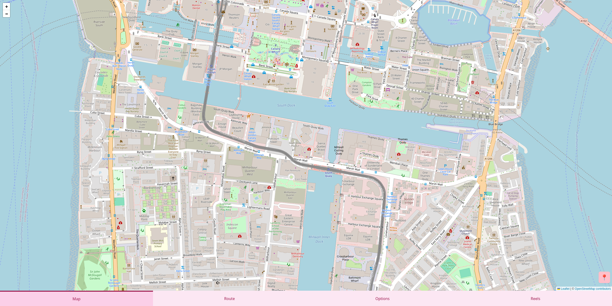
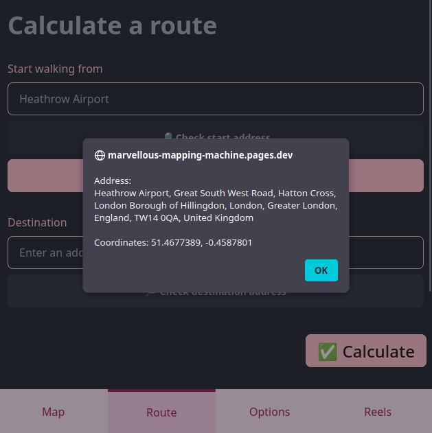

# Marvellous Mapping Machine

## Try it out

**🧑‍💻 Visit <https://marvellous-mapping-machine.pages.dev/> to use the app :D**

Alternative domains:

- <https://mmmm.20240821.xyz/>

## Screenshots





## Development instructions for backend

### Preparation

Ensure you have Python v3.10+ installed.

Clone the repository and change directory to the `backend` folder in this repository:

```bash
cd backend
```

### Virtual environment

Create a virtual environment. For example, on a personal computer running Linux, you can create a venv in the project directory:

```bash
python3 -m venv .venv
```

If you're on a school computer, you can't create a venv in your `H:` drive, so create it somewhere on the `C:` drive. E.g. in Git Bash:

```bash
py -m venv "$USERPROFILE/venvs/marvellous-mapping-machine"
```

Or in Powershell:

```powershell
py -m venv "$env:USERPROFILE\venvs\marvellous-mapping-machine"
```

### Activate the virtual environment

In VSCode, run the **Python: Select Interpreter** command. If the venv is in the project directory, you can directly select it from the list. If it's elsewhere, manually enter the path to the venv.

Alternatively, activate the venv in the terminal, e.g. in Linux:

```bash
source .venv/bin/activate
```

### Install dependencies

```bash
python -m pip install -r backend/requirements.txt
```

### Run the program

```bash
python backend/main.py
```

## Development instructions for frontend

### Preparation

Ensure you have Node.JS and Yarn v1 installed.

Clone the repository and change directory to the `frontend` folder in this repository:

```bash
cd frontend
```

### Install dependencies

Run:

```bash
yarn
```

### Start development server

Run

```bash
yarn dev
```

And access the frontend using the URL displayed in your terminal.

### Quirks

Note that Python code is only updated when the build tool starts (i.e. no live reload), so if you want to edit Python code while previewing the frontend, you should restart the Vite dev server after editing to see your changes.

## AI usage statement

### AI usage for the prototype

Development of this project up to and including the [v0.1.0](https://github.com/RandomSearch18/marvellous-mapping-machine/tree/v0.1.0) tag (i.e. up to and including March 2025) was not assisted by AI in any way.

### AI usage after the prototype

Development of the project after the v0.1.0 tag (i.e. June 2025 onwards) has been assisted by AI in the following ways:

- I use GitHub Copilot's inline completions and edit suggestions for small sections of code (up to a few lines)

## License

Copyright &copy; 2025 RandomSearch (Mish)

Marvellous Mapping Machine is free software: you can redistribute it and/or modify
it under the terms of the GNU Affero General Public License as published
by the Free Software Foundation, either version 3 of the License, or
(at your option) any later version.

This program is distributed in the hope that it will be useful,
but WITHOUT ANY WARRANTY; without even the implied warranty of
MERCHANTABILITY or FITNESS FOR A PARTICULAR PURPOSE. See the
GNU Affero General Public License for more details.

You should have received a copy of the GNU Affero General Public License
along with this program. If not, see <https://www.gnu.org/licenses/>.


